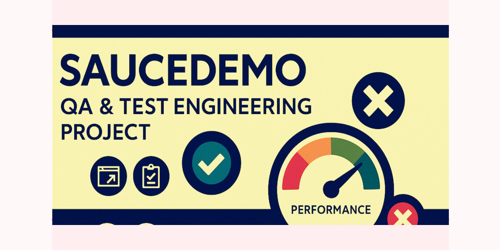

\# SauceDemo QA \& Test Engineering Project

<p align="center">
  
</p>


Manual + (planned) automation test assets for the \[Sauce Demo](https://www.saucedemo.com/) sample e‑commerce site.  

\*\*Purpose:\*\* Demonstrate end‑to‑end QA skills: test design, execution evidence, performance analysis, accessibility checks, and traceable defects.


> This repository is a \*portfolio\* style project – not an official Sauce Labs repo.

## Test Scope & Coverage Snapshot

| Area                         | Included | Notes |
|------------------------------|----------|-------|
| Functional (Desktop)         | ✅ | Login, inventory listing, cart add/remove, checkout steps, sorting, logout, session clearing |
| Performance                  | ✅ (executed) | **TC‑010 FAIL** – max image finish 15 293 ms (> 10 000 ms) (IMG‑PERF‑001)<br>**TC‑014 FAIL** – Lighthouse score 73 (PERF‑LH‑BASE‑001) |
| Accessibility (Keyboard)     | ✅ (executed) | **TC‑011 FAIL** – missing visible focus indicator (ACC‑FOCUS‑001) |
| Mobile (Smoke)               | ✅ (executed) | Add‑to‑cart flow – **TC‑012 PASS** |
| Negative / Validation        | 🟡 (planned) | Invalid creds & form‑field cases still to be covered |
| Automation (pytest scaffold) | 🟡 (planned) | TC‑015 defined – framework not yet executed |
| Security / API              | ❌ | Out of scope for this portfolio |
| Visual Regression            | ❌ | Not implemented yet |

> _Legend:_ ✅ Implemented • 🟡 Partial / In Progress • ❌ Not in current scope

## Smoke Test (TC-015)

This repo includes a minimal Selenium + pytest smoke test:

**What it does:**  
Logs in to https://www.saucedemo.com, adds the Backpack item, asserts the cart badge = 1.

### Run locally

```bash
python -m venv .venv
.\.venv\Scripts\activate
pip install -r requirements.txt

# (Optional) create/update .env
# URL=https://www.saucedemo.com/
# USER=standard_user
# PASS=secret_sauce

pytest -m smoke -v

### Current Metrics

- **Total Test Cases Defined:** 15  
- **Executed This Cycle:** 15  
- **Pass:** 12  
- **Fail:** 3 (Performance – TC‑010, Accessibility – TC‑011, Performance – TC‑014)  
- **Not Yet Executed:** 0  
- **Pass %:** 80 %
- **Open Defects:** IMG-PERF-001, ACC-FOCUS-001, PERF-LH-BASE-001

### Open Defects
- [IMG‑PERF‑001](../../issues/11) – Product images slow (>10 s) (TC‑010)
- [ACC‑FOCUS‑001](../../issues/12) – Focus indicator missing (TC‑011)
- [PERF‑LH‑BASE‑001](../../issues/13) – Lighthouse score 73 (TC‑014)


> _Legend:_ ✅ Implemented • 🟡 Partial / In Progress • ❌ Not in current scope

## Repository Structure

> *Evolving layout – currently definitions & executions are combined; will be split for maintainability.*

```text
.
├── manual-evidence/
│   ├── execution_report.md      # Test case executions + evidence links (includes TC-010 + TC-011 fails)
│   └── screenshots/             # PNG evidence assets
├── assets/                      # Social preview / icons (e.g., og-banner.png)
├── env/                         # (Planned) Environment & tooling notes (browser versions, network profiles)
├── test-cases/                  # (Planned) Individual static TC definition files (TC-001.md etc.)
├── automation/                  # (Planned) Selenium / pytest (or Playwright) smoke tests
├── defects/                     # (Planned) Markdown defect records (one per issue) or ISSUE_TEMPLATE
└── README.md
